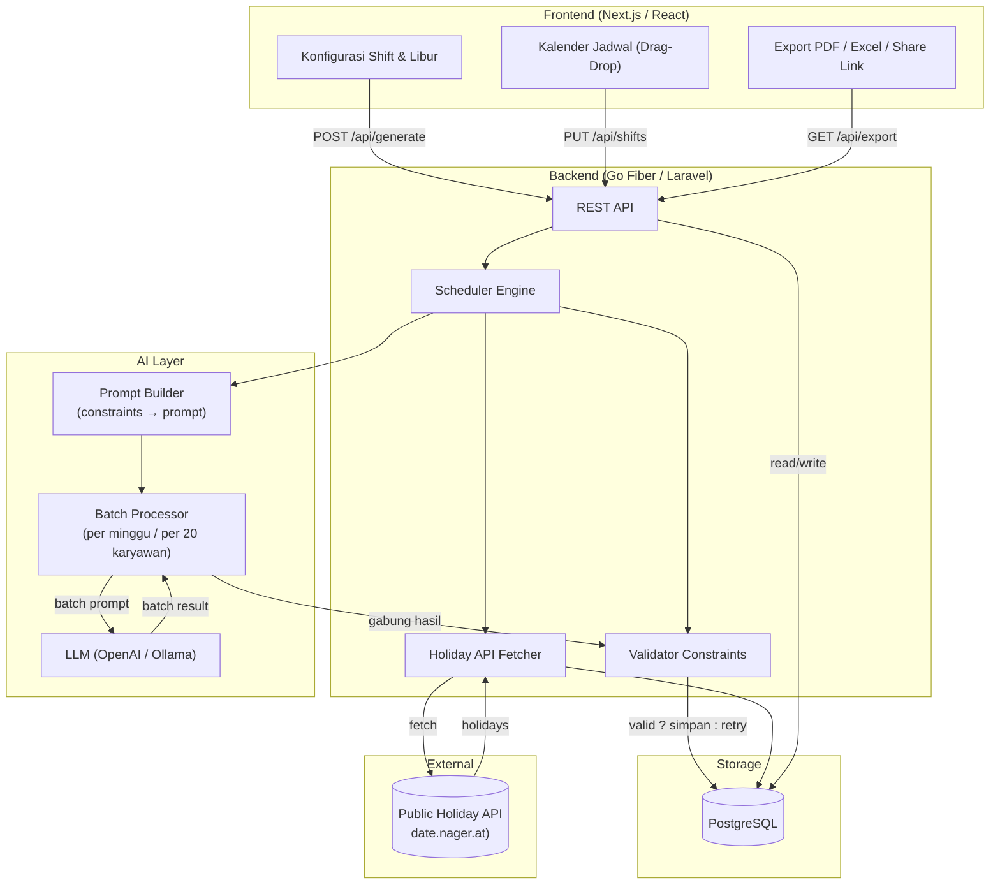
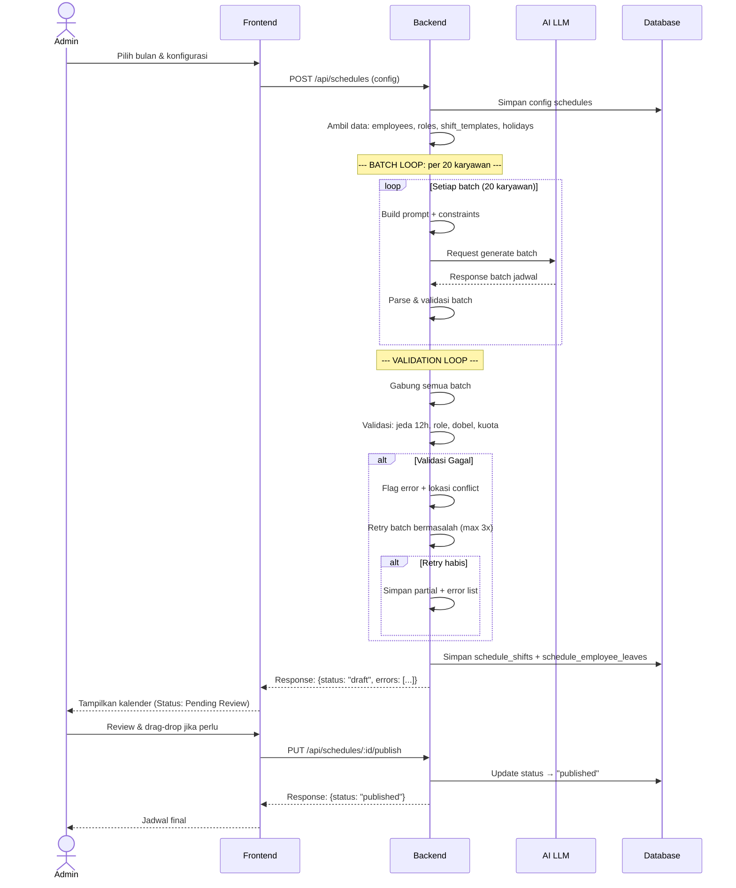
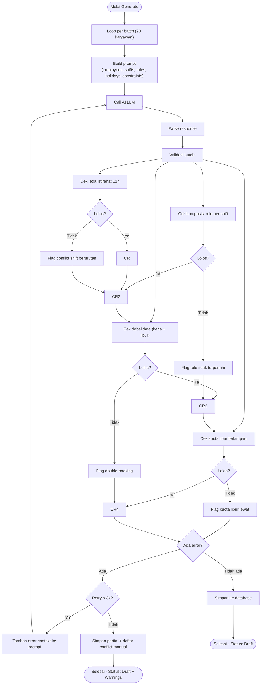
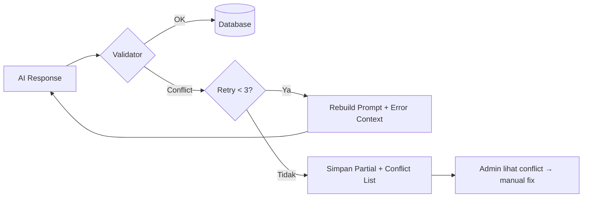

# System Architecture & AI Flow: autoShift

---

## 1. Arsitektur Keseluruhan



---

## 2. Alur Generate Jadwal (End-to-End)



---

## 3. Validation Loop Detail



---

## 4. REST API Endpoints

| Method | Endpoint | Fungsi |
|---|---|---|
| `POST` | `/api/schedules` | Buat schedule baru + trigger AI generate |
| `GET` | `/api/schedules/:id` | Ambil detail schedule + semua shift |
| `PUT` | `/api/schedules/:id/shifts` | Update shift (drag-drop manual) |
| `PUT` | `/api/schedules/:id/publish` | Publish jadwal (draft → published) |
| `GET` | `/api/schedules/:id/export` | Export PDF/Excel |
| `GET` | `/api/schedules/:id/share` | Generate public share link (read-only) |
| `GET` | `/api/holidays?year=2026` | Ambil daftar tanggal merah |

---

## 5. Batch Processing Strategy

```
Input: 200 employees × 30 hari
                │
                ▼
        Split per 20 karyawan
                │
        ┌───────┼───────┐
        ▼       ▼       ▼
    Batch 1  Batch 2  Batch 3 ... Batch 10
    (20 org) (20 org) (20 org)   (20 org)
        │       │       │           │
        ▼       ▼       ▼           ▼
    AI gen   AI gen   AI gen      AI gen
        │       │       │           │
        └───────┼───────┼───────────┘
                ▼       ▼
            Validator Gabung
                │
                ▼
          Simpan ke DB
```

Setiap batch adalah 1 prompt AI yang berisi:
- 20 karyawan + role mereka
- 1 minggu penuh (7 hari) — atau 30 hari jika karyawannya sedikit
- Shift templates + jam kerja
- Mode libur + holidays
- Constraints: jeda 12h, komposisi role, kuota libur
- **Error context dari batch sebelumnya** (jika retry)

---

## 6. Prompt Structure (Template)

```
Kamu adalah asisten penjadwal shift. Buat jadwal yang ADIL.

KONFIGURASI:
- Periode: 1-7 Juli 2026
- Shift: Pagi (08:00-16:00), Siang (16:00-00:00), Malam (22:00-06:00, cross-day)
- Mode libur: Random, 2 hari/minggu (tidak terpengaruh tanggal merah)
- Tanggal merah: 0 (tidak ada di minggu ini)
- Jeda minimal antar shift: 12 jam

KARYAWAN (batch 1/10):
1. Budi (Supervisor) - kuota libur: 2 hari
2. Siti (Staff) - kuota libur: 2 hari
3. Andi (Staff) - kuota libur: 2 hari
...

ROLE REQUIREMENTS:
- Shift Pagi: min 1 Supervisor
- Shift Siang: min 1 Supervisor
- Shift Malam: min 1 Supervisor

HASIL GENERATE SEBELUMNYA (untuk batch 1):
(Batch ini adalah batch pertama, tidak ada konflik sebelumnya)

FORMAT OUTPUT (JSON):
{
  "shifts": [
    {"employee_id": 1, "date": "2026-07-01", "shift_template_id": 1},
    ...
  ],
  "leaves": [
    {"employee_id": 1, "date": "2026-07-02"},
    ...
  ]
}
```

---

## 7. Error Handling & Retry Strategy



| Error Type | Retry Action | Final Action |
|---|---|---|
| Jeda istirahat < 12h | Tambah constraint ke prompt | Flag manual fix |
| Role kurang (no supervisor) | Tambah role requirement ke prompt | Flag manual fix |
| Kuota libur terlampaui | Kurangi jatah libur di prompt | Tampilkan warning |
| Double-booking | Prioritaskan shift, hapus libur | Tampilkan warning |
| Format JSON tidak valid | Re-prompt dengan format tegas | Error ke admin |
| AI timeout/hallucination | Retry dengan batch lebih kecil | Simpan partial |

---

## 8. Tech Stack Recommendation

| Layer | Opsi 1 (Recommended) | Opsi 2 | Alasan |
|---|---|---|---|
| Frontend | Next.js 14+ (React) | Vue 3 + Nuxt | Komunitas besar, kalender library banyak |
| Backend | Go Fiber | Laravel | Performa tinggi untuk batch processing |
| Database | PostgreSQL | MySQL | Dukungan INTERVAL, TIMESTAMP, ENUM |
| ORM | GORM (Go) / sqlc | Eloquent (Laravel) | — |
| AI LLM | OpenAI GPT-4o / Ollama (local) | Claude API | Pilih based on budget & privacy |
| Holiday API | date.nager.at | GitHub public API | Gratis, no auth needed |
| UI Calendar | @fullcalendar/react (drag-drop) | Custom | Sudah support drag & drop bawaan |
